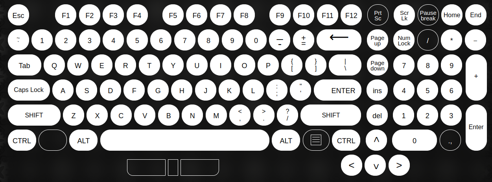

# PicoS2
## RPi Pico macro-keyboard project which uses a PS/2 keyboard's input to send keystrokes to the computer.

## To build, you need Pico SDK in your path, arm compilers (see CMakeLists.txt) and copy pico_sdk_import.cmake in the folder, next to ps2_macro_keyboard.cpp!

### Notes
On Windows, the USB descriptors fail. The hid_composite example works, and I use the same configuration files for this project, and it fails for some reason.
The USB functionality works (on Linux). Note: when multiple keys are pressed on the PS/2 keyboard, the display and the terminal is working correctly, but only 1 USB signal is sent. This is not affecting macro functionality, only means that only 1 macro can be sent at a time.

## Building
### Wiring. 
You need a soldering iron, wire cutter and preferably a PS/2 jack to connect the keyboard.
See the wiring folder for more info.
### Code
0. Install and set up Pico SDK (add to path!)
1. clone the repo
2. change the keyboard macro definitions by editing usb_codes.h (you can remove unnecessary keys by actually removing them from that list) - see example at F1 and F2
3. edit the CMakeLists.txt (if necessary)
4. enable/disable modules by editing the macros below
5. mkdir build, cd build
6. cmake ..
7. make
8. copy the .uf2 file to the Pico (hold bootsel button and plug in)
9. enjoy.

Some info about PS/2 protocol: [hungarian](http://www.vfx.hu/info/atkeyboard.html), [english 1](https://www.avrfreaks.net/sites/default/files/PS2%20Keyboard.pdf), [english 2](https://karooza.net/how-to-interface-a-ps2-keyboard)

### Working keys
The keys that can be read from the PS/2 keyboard.

**I accept any help and suggestions.**

