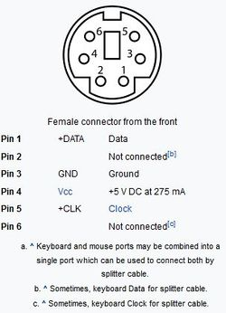
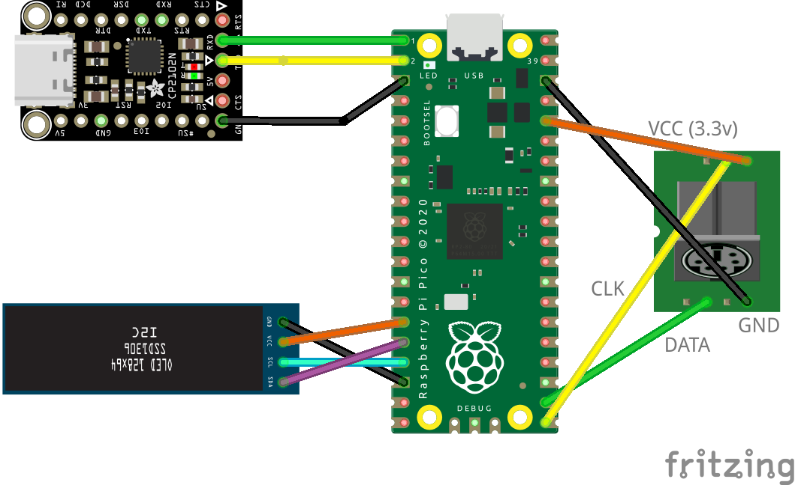

# PicoS2
## Wiring

Connect the PS/2 socket (mini-DIN 6P) pin 1 (data) to GP17 and pin 5 (clock) to GP16
Connect the PS/2 socket pin 3 (ground) to any ground on the Pico
Connect the PS/2 socket pin 4 (vcc) to Pico physical pin 36. It is important to NOT connect it to 5 volts, else it will fry your Pi (The keyboard works perfectly with 3.3 volts as well!)

Optional: To see serial output, connect USB to TTL adapter RX pin to GP0 and TX pin to GP1
Optional: Connecting an OLED SSD1306 module: GND to any GND, SCL to GP13, SDA to GP12 and VCC to GP11

**I accept any help and suggestions.**

